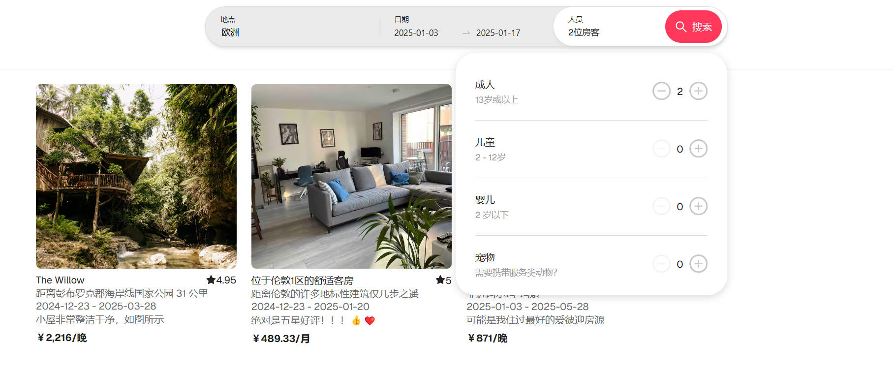
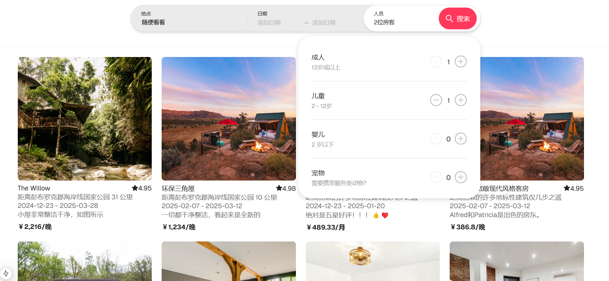

#### 技术栈：next.js + TailWind CSS + Redux + scss + mockjs + axios + dayjs + antd

## 项目启动 仿 aribnb 搜索框实现

安装并运行项目

```bash
npm install
npm run dev
```

浏览器输入网址打开网站 [http://localhost:3000](http://localhost:3000)

## 组件完成情况

1. 根据地址 : 选择 “区域 国家 城市 任意”检索
   
2. 根据时间范围检索 没选时间默认近一周时间
   
3. 根据成员个数进行检索 对 成人 儿童 宠物 婴儿人数进行检索 没选筛选出全部房源
   
4. 人数边界值判断：儿童，婴儿，宠物必须有成人陪同
   
5. 加载中处理、无数据处理
   
   
